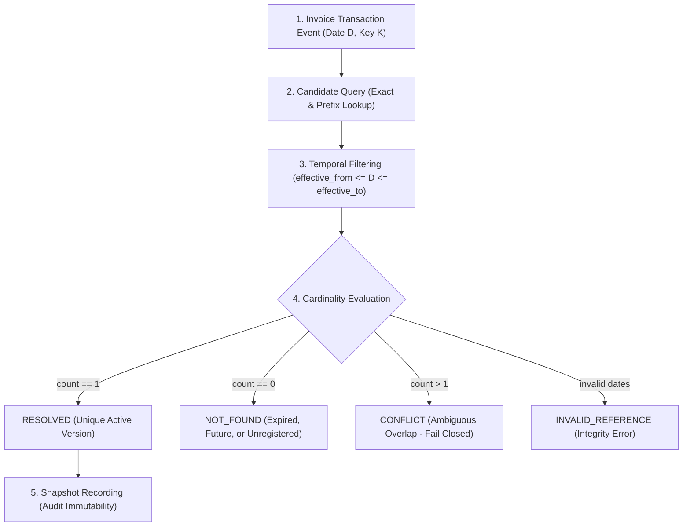

# SPRINT 4: RULE & REFERENCE INTELLIGENCE

## UC15 — GST Compliance Intelligence & Resolution Agent

**Author:** Senior Python Backend Engineer & Enterprise AI/Compliance Architect  
**Sprint:** 4 of 15  
**Status:** Completed & Validated  
**Test Suite:** 129 Tests Passing (115 Unit/Integration + 14 Statutory Regression)

---

## 1. Why Reference Intelligence is Separated from Validation Algorithms

In enterprise compliance, tax calculation, and ERP systems (such as SAP Tax Engine or Vertex), **statutory rules and regulatory master data change on different lifecycles**:

1. **Validation Algorithms (The "How"):** The computational logic of verifying a transaction (e.g. verifying whether applied rate matches statutory schedule within tolerance, or verifying whether place of supply dictates IGST vs CGST+SGST). These algorithms are relatively stable over time.
2. **Statutory Reference Data (The "What"):** Rates, tariff codes, exemption thresholds, state codes, and restricted lists are modified frequently by legislative acts, GST Council meetings, and administrative circulars (e.g., rate changes on computing hardware, changes to E-Way Bill intrastate thresholds, or addition of new Union Territories such as Ladakh).

### Architectural Anti-Pattern vs. Enterprise Solution
* **Anti-Pattern (Hardcoded Master Data):** Hardcoding HSN rates into dictionaries or rule classes directly couples compliance algorithms to a single historical point in time. When a rate changes, past invoices cannot be audited accurately without breaking current invoice checks.
* **Enterprise Solution (Reference Intelligence):** Strict separation of concerns:
  ```text
  ┌─────────────────────────────────────────────────────────────┐
  │                   COMPLIANCE RULE LAYER                     │
  │           (Algorithms: How to check compliance)             │
  └──────────────────────────────┬──────────────────────────────┘
                                 │ queries with transaction_date
                                 ▼
  ┌─────────────────────────────────────────────────────────────┐
  │               REFERENCE INTELLIGENCE SERVICE                │
  │         (Temporal Resolution: effective_from <= D <= to)    │
  └──────────────┬───────────────────────────────┬──────────────┘
                 │                               │
                 ▼                               ▼
  ┌─────────────────────────────┐ ┌─────────────────────────────┐
  │   REFERENCE REPOSITORIES    │ │     REFERENCE SNAPSHOT      │
  │   (Catalog index & storage) │ │ (Immutable audit per-inv)   │
  └─────────────────────────────┘ └─────────────────────────────┘
  ```

---

## 2. Reference Resolution Lifecycle

For every transaction being validated, reference resolution proceeds through a deterministic 5-stage lifecycle:



1. **Candidate Retrieval:** Look up records by identifier, HSN code, state code, or policy category.
2. **Temporal Window Validation:** Filter candidates whose effective date window encompasses the transaction date `D`:
   $$\text{effective\_from} \le D \le \text{effective\_to}$$
3. **Status Check:** Exclude superseded, inactive, or draft records.
4. **Resolution Categorization:**
   - **RESOLVED:** Exactly one record matches.
   - **NOT_FOUND:** Zero records match (distinguishes whether code never existed, or is expired/future).
   - **CONFLICT:** Two or more active records match the same transaction date.
   - **INVALID_REFERENCE:** Record has inverted or malformed date ranges.
5. **Snapshot Attachment:** The resolved record ID and version are immutably captured into `ReferenceSnapshot`.

---

## 3. Effective-Date Boundary Handling

The `EffectiveDateResolver` enforces rigorous, inclusive date boundary mathematics:

| Scenario | Target Date | `effective_from` | `effective_to` | Outcome | Justification |
| :--- | :--- | :--- | :--- | :--- | :--- |
| **Before Window** | `2017-06-30` | `2017-07-01` | `2021-12-31` | `NOT_FOUND` | Pre-GST transaction date; reference not yet active. |
| **Start Boundary** | `2017-07-01` | `2017-07-01` | `2021-12-31` | `RESOLVED` | `effective_from` is inclusive. |
| **Inside Window** | `2019-06-15` | `2017-07-01` | `2021-12-31` | `RESOLVED` | Mid-period transaction. |
| **End Boundary** | `2021-12-31` | `2017-07-01` | `2021-12-31` | `RESOLVED` | `effective_to` is inclusive. |
| **After Window** | `2022-01-01` | `2017-07-01` | `2021-12-31` | `NOT_FOUND` | Post-expiry transaction. |
| **Open-Ended** | `2028-10-05` | `2022-01-01` | `None` | `RESOLVED` | `effective_to = None` represents indefinite active validity. |
| **Inverted Range** | `2022-01-01` | `2025-01-01` | `2020-01-01` | `INVALID_REFERENCE` | Data integrity violation. |

---

## 4. Versioning Strategy

All reference entities inherit from `BaseReferenceRecord` and follow semantic enterprise version tags:

* **Major Version Bump (`X.0`):** Material statutory changes (e.g. GST Council rate shifts from 12% to 18%, or statutory reorganization of states).
* **Minor Version Bump (`X.Y`):** Clarifications, administrative circular references, non-rate wording updates, or expanded descriptions.
* **Provenance Tracking:** Every record contains `source` (e.g. `OFFICIAL_GST`) and `source_reference` (e.g. `Notification No. 1/2017-Integrated Tax (Rate)`).

---

## 5. Reference Snapshot Design & Audit Immutability

To prevent retroactive audit drift, compliance results must record **exactly which version of which reference was active and evaluated at validation time**.

The `ReferenceSnapshot` model provides:
* `invoice_id`: Target invoice key.
* `transaction_date`: Statutory date evaluated.
* `hsn_reference_id` / `hsn_reference_version`: Resolved HSN identity.
* `tax_rate_reference_id` / `tax_rate_reference_version`: Resolved tax schedule identity.
* `state_reference_id` / `state_reference_version`: Resolved state identity.
* `ewb_policy_id` / `ewb_policy_version`: Resolved E-Way Bill policy identity.
* `itc_policy_id` / `itc_policy_version`: Resolved ITC restriction policy identity.
* `resolved_records`: Deep dictionary of resolved attributes.
* `resolved_at`: ISO-8601 UTC timestamp of execution.

The snapshot is embedded in `ValidationReport.metadata["reference_snapshot"]` and passed into `ComplianceDecision.reference_snapshot`.

---

## 6. Missing Reference Policy

Enterprise tax engines must never guess when a reference is missing:
* **Gate 2 (HSN Validity):** If HSN is `NOT_FOUND` on transaction date, Gate 2 fails with:
  `HSN code {hsn_code} was not found in the HSN/SAC master.`
* **Gate 3 (Tax Rate Correctness):** Cascades to failure:
  `Cannot verify rate - HSN code not found.`
* **Gate 4 (Place of Supply):** If state code cannot be resolved:
  `Could not resolve state for GSTIN prefix {state_code}.`
* **Evidence Enrichment:** In all missing reference cases, structured evidence records:
  ```json
  {
    "resolution_status": "NOT_FOUND",
    "master_found": false,
    "transaction_date": "2023-01-01"
  }
  ```

---

## 7. Conflicting Reference Policy

A critical vulnerability in naive resolution systems is silently picking the first record when multiple active versions match. In UC15:
* When two active records overlap on target date, resolution status is `CONFLICT`.
* The rule immediately returns a `FAIL` status with explicit diagnostic messaging:
  `HSN resolution conflict: multiple active versions found for HSN code '{hsn_code}' on {target_date}.`
* Evidence captures all conflicting candidate IDs and versions for tax master administrator remediation.

---

## 8. Performance & Caching Strategy

Statutory references change infrequently during a batch run. To achieve sub-millisecond execution:
* **Memoization Cache:** `ReferenceService` maintains a tuple-keyed resolution cache:
  ```python
  cache_key = (reference_type, entity_code_or_key, target_date_iso)
  ```
* **Thread-Safe In-Memory Indexes:** `InMemoryReferenceRepository` pre-indexes records by code and prefix (supporting 8-digit, 6-digit, 4-digit, and 2-digit HSN matching).
* **Zero Disk I/O during validation:** External JSON catalogs are validated and loaded once during engine initialization.

---

## 9. Data Contracts & Schema Specifications

### Base Reference Schema
```text
BaseReferenceRecord:
  - reference_id: str
  - reference_type: str (HSN | TAX_RATE | STATE | EWB_POLICY | ITC_POLICY)
  - version: str
  - effective_from: date
  - effective_to: Optional[date]
  - status: str (ACTIVE | INACTIVE | SUPERSEDED)
  - source: str
  - source_reference: Optional[str]
  - created_at: str (ISO-8601 UTC)
```

### Entity Schemas
* **`HSNReference`:** Extends base with `code`, `description`, `code_type`, `chapter`, `heading`, `subheading`, `tariff_item`, default rates.
* **`TaxRateReference`:** Extends base with `hsn_code`, `cgst_rate`, `sgst_rate`, `igst_rate`, `cess_rate`, `rate_type`, `notification_no`.
* **`StateReference`:** Extends base with `state_code` (2-digit), `state_name`, `state_or_ut`, `tin_prefix`.
* **`EWBPolicyReference`:** Extends base with `policy_id`, `threshold`, `interstate_threshold`, `intrastate_threshold`, `exempted_hsn`.
* **`ITCPolicyReference`:** Extends base with `policy_id`, `category`, `blocked_keywords`, `is_blocked_17_5`, `requires_2b_reconciliation`.

---

## 10. Repository Pattern & Storage Abstraction

All reference operations are decoupled through the `BaseReferenceRepository` interface:
```text
BaseReferenceRepository (ABC)
  ├── InMemoryReferenceRepository (High-performance in-memory index)
  └── [Future: SQLite / PostgreSQL / SAP RFC Repository]
```
This enables future database-backed or remote API catalog synchronization without modifying compliance rules.

---

## 11. Backward Compatibility Strategy

Sprint 4 guarantees 100% backward compatibility with Sprints 1, 2, and 3:
1. `ValidationContext` maintains `.get_hsn(code)` and `.get_state_name(code)`.
2. Existing test suites passing mock dictionaries (e.g. `hsn_master={...}`) are prioritized in rule lookups.
3. If no legacy dictionary is passed, `ValidationContext` transparently delegates to `ReferenceService`.
4. Exactly identical failure messages and gate numbering are preserved across all 6 statutory gates.

---

## 12. Externalized Reference Catalog

Statutory datasets are fully externalized into version-controlled JSON catalogs under `config/references/`:

| Directory | Catalog File | Records | Content Description |
| :--- | :--- | :--- | :--- |
| `config/references/hsn/` | `hsn_master.json` | 18 | Statutory chapters 84, 85, 87, 72, 39, 40, 99; demo codes, expired codes, future codes. |
| `config/references/tax/` | `tax_rates.json` | 29 | Official CGST, SGST, IGST schedules, historical rate shift transitions, concessional rates. |
| `config/references/states/` | `states.json` | 25 | Standard 2-digit GST state/UT directory (Maharashtra, Delhi, Karnataka, Ladakh, etc.). |
| `config/references/ewb/` | `ewb_policies.json` | 4 | National Rule 138 policy (INR 50,000) and state-specific policies (Delhi/Maharashtra INR 100,000). |
| `config/references/itc/` | `itc_policies.json` | 5 | Statutory Section 17(5) blocked credit policies (motor vehicles, catering, club, personal gifts, write-offs). |

---

## 13. Test Suite Verification

The Sprint 4 implementation was verified against three levels of automated testing:

```text
============================================================
Test Suite Execution Results
============================================================
Unit & Integration Tests : 115 / 115 PASSED (100%)
Statutory Regression     :  14 /  14 PASSED (100%)
Total Passing Tests      : 129 / 129 PASSED (100%)
Execution Time           : 2.3 seconds
============================================================
```

### New Sprint 4 Test Modules:
1. `tests/unit/test_reference_models.py`: Structural data contract integrity, negative rate rejection, inverted date detection, state padding, EWB thresholds, ITC keyword boundaries.
2. `tests/unit/test_effective_date_resolver.py`: Boundary matrix testing (before, start date, mid-window, end date, post-expiry, open-ended, conflict detection, invalid date ranges).
3. `tests/unit/test_reference_service.py`: Exact HSN matching, hierarchical prefix fallback, date-sensitive rate shifts, state normalization, EWB national vs state policies, ITC policies, caching.
4. `tests/integration/test_reference_pipeline.py`: End-to-end historical invoice validation across 2020 vs 2022 rate shifts, expired HSN handling, conflict fail-safe testing, and snapshot verification.

---

## 14. Enterprise Readiness & Future Sprint Roadmap

The architecture completed in Sprint 4 provides a battle-tested reference foundation for subsequent sprints:
* **Sprint 5 (Historical Intelligence):** Auditing past transactions against historical versions of tax rules.
* **Sprint 6 (Financial Exposure):** Calculating exact under/over-taxation deltas using temporal rates.
* **Sprint 7 (Anomaly Detection):** Detecting unexpected deviations in HSN classification or rate patterns.
* **Sprint 8 (RAG / Regulatory Intelligence):** Linking reference records to statutory notifications and circular text.
* **Sprint 9+ (Autonomous Agent & Resolution):** Proposing automated corrections grounded in active statutory master data.
