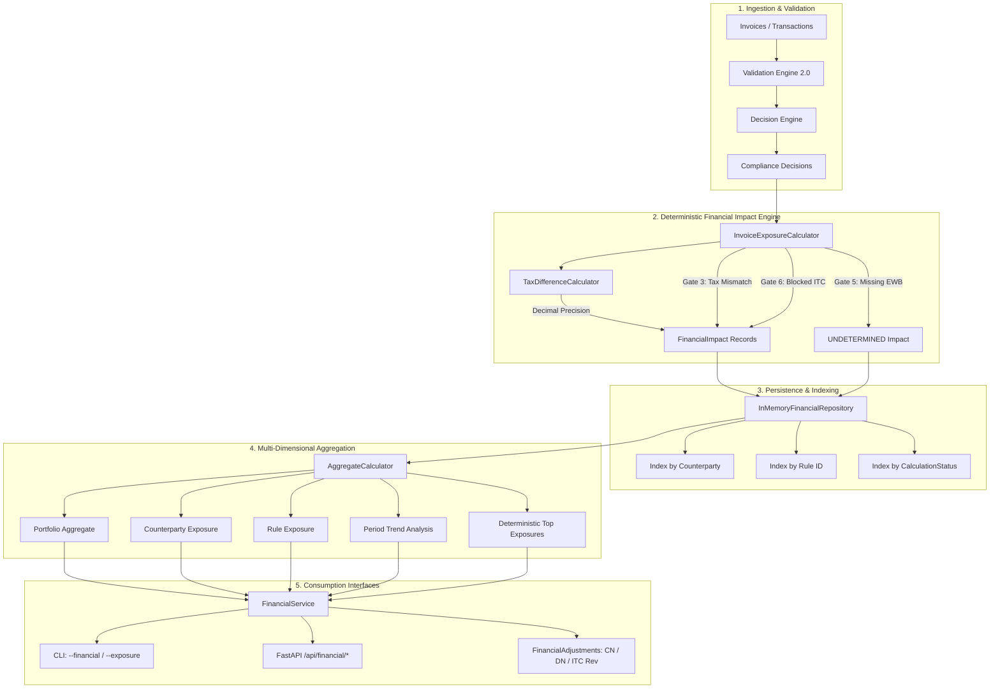
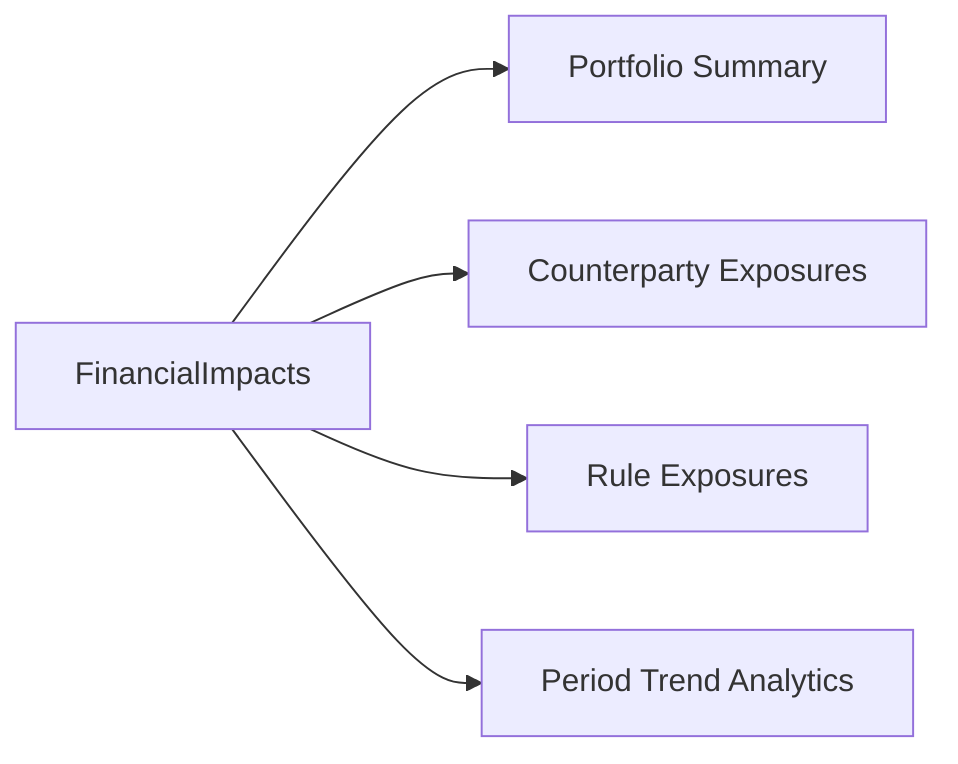

# Sprint 6 — Financial Impact & Exposure Intelligence

## Executive Summary

Sprint 6 elevates the UC15 GST Compliance Intelligence & Resolution Agent from **statutory verification** ("Does this invoice comply with GST rules?") to **deterministic financial quantification** ("What is the potential monetary exposure, what is the direction of discrepancy, which counterparties drive this exposure, and what accounting adjustments are needed?").

### Key Architectural Principles
1. **Zero Hallucination / Zero Heuristics**: Financial calculations use strictly deterministic mathematics executed with Python's `decimal.Decimal` module using `ROUND_HALF_UP` to two decimal places. No floating-point drift is possible.
2. **Explicit Directionality**: Every tax difference is classified as `OVERCHARGED_TAX`, `UNDERCHARGED_TAX`, or `NO_TAX_DIFFERENCE`.
3. **Rigorous Handling of Missing Policies**: Missing statutory penalties (such as unconfigured E-Way Bill fines) or missing financial inputs (e.g. absent taxable value) evaluate strictly to `CalculationStatus.UNDETERMINED`. Undetermined records are tracked transparently but **excluded from monetary exposure totals**.
4. **Actionable Ledger Adjustments**: Automatically generates recommendations for Section 34 Credit Notes, Debit Notes, and Table 4(B) ITC Reversals.

---

## Primary Architecture Diagram

---

## Deterministic Financial Mathematical Models

All monetary values and rates are converted to `decimal.Decimal` before any arithmetic operations. Calculations adhere to standard statutory rounding:

$$\text{Monetary Rounding} = \text{quantize}(\text{Decimal}("0.01"), \text{rounding}=\text{ROUND\_HALF\_UP})$$

### 1. Tax Rate Mismatch Formula
Given taxable value $V$, recorded rate $R_{rec}$, and expected statutory rate $R_{exp}$:

$$\Delta R = R_{rec} - R_{exp}$$
$$\text{Recorded Tax} = \text{round}\left(V \times \frac{R_{rec}}{100}\right)$$
$$\text{Expected Tax} = \text{round}\left(V \times \frac{R_{exp}}{100}\right)$$
$$\text{Potential Exposure} = |\text{Recorded Tax} - \text{Expected Tax}|$$

### 2. Blocked ITC Formula
Under Section 17(5) of the CGST Act, 2017, input tax credit claimed on ineligible goods/services (e.g. food & beverages, motor vehicles) is blocked in full:

$$\text{ITC Potential Exposure} = \text{Total Input Tax Claimed}$$

---

## Exposure Taxonomy & Calculation Statuses

| Calculation Status | Meaning | Monetary Inclusion in Totals | Example Trigger |
| :--- | :--- | :---: | :--- |
| `CALCULATED` | All requisite inputs present; exact statutory formula applied. | **YES** | Gate 3 rate mismatch with verified rates and taxable value. |
| `PARTIALLY_CALCULATED` | Certain line-items quantified; others pending missing metadata. | **YES** (Quantified portions) | Multi-item invoice where 2 items are quantified, 1 lacks HSN. |
| `UNDETERMINED` | Required formula, penalty policy, or input values are absent. | **NO** (Strictly excluded) | Missing E-Way Bill with no configured penalty matrix. |
| `NOT_APPLICABLE` | Compliant transaction or non-monetary finding. | **NO** (0.00 INR) | Fully compliant invoice; Gate 6 evaluated on AR invoice. |

---

## Directional Consequence Framework

| Direction | Trigger Condition | Accounting / Legal Meaning | Recommended Action |
| :--- | :--- | :--- | :--- |
| `OVERCHARGED_TAX` | $R_{rec} > R_{exp}$ | Supplier charged higher tax than statutory schedule. | Request Supplier Credit Note under Section 34(1). |
| `UNDERCHARGED_TAX` | $R_{rec} < R_{exp}$ | Supplier charged lower tax than statutory schedule. | Request Supplier Supplementary Invoice / Debit Note under Section 34(3). |
| `NO_TAX_DIFFERENCE` | $R_{rec} = R_{exp}$ | Recorded tax exactly matches schedule. | None (Compliant rate). |
| `NOT_APPLICABLE` | N/A | Finding does not involve tax rate differences. | Governed by specific rule category (e.g. ITC reversal). |

---

## Component-Level Split Logic

Tax differences are split deterministically across statutory components based on supply type:

### Intra-State Supply (CGST + SGST)
- Equal division of tax across Central and State jurisdictions:
  $$\Delta \text{CGST} = \text{round}\left(\frac{\Delta \text{Tax}}{2}\right)$$
  $$\Delta \text{SGST} = \Delta \text{Tax} - \Delta \text{CGST}$$
  $$\Delta \text{IGST} = 0.00$$

### Inter-State Supply (IGST)
- Full discrepancy allocated to Integrated GST:
  $$\Delta \text{IGST} = \Delta \text{Tax}$$
  $$\Delta \text{CGST} = 0.00, \quad \Delta \text{SGST} = 0.00$$

---

## Statutory Gate-to-Financial Mappings

1. **Gate 3 — Tax Rate Compliance**:
   - Compares recorded tax rate against statutory HSN reference schedule.
   - Computes direction, component differences, and overall exposure.
2. **Gate 6 — ITC Eligibility**:
   - AP Invoices: Evaluates Section 17(5) blocked keyword matches. Blocked claims result in `ITC_EXPOSURE` equal to the input tax claimed.
   - AR Invoices: Evaluates to `CalculationStatus.NOT_APPLICABLE` (exposure = 0.00).
3. **Gate 5 — E-Way Bill Compliance**:
   - Missing E-Way Bill on goods movement exceeding Rs. 50,000 threshold.
   - Evaluates strictly to `CalculationStatus.UNDETERMINED` with `required_data=["ewb_penalty_policy"]`. Never invents arbitrary penalties.

---

## Multi-Dimensional Exposure Aggregation

`AggregateCalculator` provides deterministic four-dimensional rollups:

1. **Portfolio Exposure**:
   - Consolidated sum of `CALCULATED` and `PARTIALLY_CALCULATED` potential exposure.
   - Directional sums (`overcharged_tax_total`, `undercharged_tax_total`).
   - Category sums (`total_tax_difference`, `total_itc_exposure`).
   - Strict tracking of `undetermined_count` without polluting monetary sums.
2. **Counterparty Exposure**:
   - Groups by `counterparty_id` (GSTIN).
   - Identifies high-exposure suppliers and systemic overcharging/undercharging.
3. **Rule Exposure**:
   - Groups by `rule_id`.
   - Isolates the statutory rules responsible for the greatest monetary exposure.
4. **Period Exposure & Trends**:
   - Groups chronologically by filing month (`YYYY-MM`).
   - Calculates month-over-month absolute and percentage change with standard $\pm 5\%$ threshold.

---

## Deterministic Top-Exposure Ranking Algorithm

To guarantee audit repeatability, top exposure sorting uses a deterministic multi-key sort:

$$\text{SortKey}(\text{Impact}) = (-\text{Potential Exposure}, -\text{Invoice Date.toordinal}(), \text{Invoice ID})$$

Tie-breaks are resolved by date (descending), then invoice ID (alphabetically ascending).

---

## Audit-Ready Adjustment Generation

`FinancialService.generate_adjustments()` produces concrete, legally-grounded ledger adjustments:

1. **Section 34(1) Credit Note Required**:
   - Generated when tax is overcharged on AP supply.
   - Action owner: `VENDOR`.
2. **Section 34(3) Debit Note Required**:
   - Generated when tax is undercharged.
   - Action owner: `VENDOR`.
3. **Section 17(5) ITC Reversal Required**:
   - Generated when blocked input tax credit is claimed.
   - Action owner: `TAXPAYER`. Instruction: Reverse in Table 4(B) of GSTR-3B.

---

## REST API Endpoints

| Endpoint | Method | Description |
| :--- | :--- | :--- |
| `/api/financial/summary` | `GET` | Complete FinancialReport with portfolio aggregate, top exposures, and adjustments. |
| `/api/financial/exposure` | `GET` | Aggregate portfolio exposure breakdown. |
| `/api/financial/top-exposures` | `GET` | Top $N$ exposures ranked deterministically (`limit` query param). |
| `/api/financial/rules` | `GET` | Exposure breakdown aggregated per statutory rule ID. |
| `/api/financial/counterparties`| `GET` | Exposure breakdown aggregated per counterparty GSTIN. |
| `/api/financial/trends` | `GET` | Chronological month-over-month exposure trend trajectories. |
| `/api/financial/adjustments` | `GET` | Recommended credit notes, debit notes, and ITC reversals. |

---

## Verification & Test Evidence

### Test Suite Execution
- **Unit & Integration Tests**: 195/195 passing.
- **Regression Suite**: 14/14 passing.
- **Total Tests Passing**: **209/209 tests**.
- **Dedicated Sprint 6 Scenarios**: 8/8 passing in `scripts/verify_s6_financial_impact.py`.
