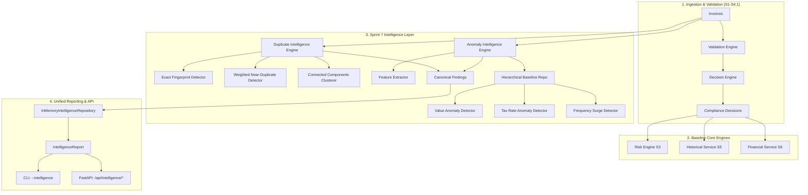
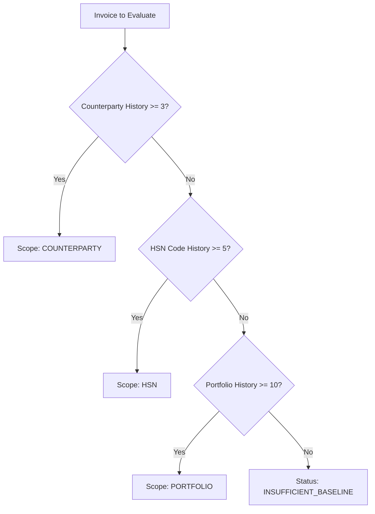

# Sprint 7 — Duplicate & Anomaly Intelligence

## 1. Executive Summary

Sprint 7 builds an explainable, deterministic **Duplicate & Anomaly Intelligence Layer** directly on top of the hardened statutory foundation (S1–S6.1). While previous sprints resolved:
- **"Is this transaction compliant?"** (S1–S4.1)
- **"What historical patterns exist across counterparties, rules, and periods?"** (S5)
- **"What is the quantified financial exposure?"** (S6–S6.1)

Sprint 7 answers:
- **"Are any transactions duplicate submissions or near-identical re-billings?"**
- **"Are any transactions statistically anomalous in value, tax rate, or frequency compared to verified baselines?"**

### Core Architectural Guarantees
1. **Strict Non-Interference**: Intelligence findings are decision-support insights. They **never** alter statutory compliance status (`COMPLIANT`, `NEEDS_REVIEW`, `NON_COMPLIANT`), validation gate outcomes, risk priority rankings, or financial liability ledgers.
2. **Zero Hallucination / Zero Heuristics**: All string distances, feature vectors, statistics (Median, MAD, IQR, Robust Z-Score), and fingerprint hashes are 100% deterministic and reproducible with standard Python libraries.
3. **Audit-Grade Lineage**: Every candidate, cluster, and anomaly finding points unambiguously to concrete source transaction identifiers and includes explicit mathematical justifications.
4. **False-Positive Immunity**: Dedicated domain guards prevent standard business patterns (such as monthly subscriptions, rent, retainers, and distinct counterparty invoices) from being falsely flagged.

---

## 2. Intelligence Architecture & Philosophy

The intelligence architecture operates downstream of statutory ingestion and validation.



---

## 3. Separation of Concerns: Duplicate vs Anomaly vs Fraud

| Concept | Scope | Method | Permitted Terminology | Forbidden Terminology |
| :--- | :--- | :--- | :--- | :--- |
| **Duplicate Intelligence** | Identity attribute collisions across 2+ transactions | SHA-256 canonical hashing + weighted Levenshtein / SequenceMatcher scoring | `EXACT_DUPLICATE`, `HIGH_CONFIDENCE_NEAR_DUPLICATE`, `POSSIBLE_DUPLICATE`, `Duplicate Cluster` | `Fraud`, `Scam`, `Fake Billing`, `Stolen Invoice` |
| **Anomaly Intelligence** | Transaction behavior deviating from historical baselines | Non-parametric statistics: Median, MAD, IQR, Robust Z-score | `ANOMALOUS`, `VALUE_ANOMALY`, `TAX_RATE_ANOMALY`, `FREQUENCY_ANOMALY`, `INSUFFICIENT_BASELINE` | `Illegal`, `Tax Evasion`, `Guilty`, `Criminal` |
| **Fraud Detection** | Legal intent to deceive or defraud tax authorities | Out of scope for automated agents; requires human juristic investigation | N/A | Never emit automated fraud verdicts |

---

## 4. Duplicate Intelligence Subsystem Architecture

The Duplicate subsystem operates as a two-stage filter:
1. **Hash-Indexed Exact Matcher**: Partitions invoices by canonical SHA-256 fingerprint in $O(N)$ time.
2. **Blocking Near-Duplicate Matcher**: Partitions invoices by counterparty/supplier GSTIN blocks and computes fine-grained attribute similarities.
3. **Graph Clusterer**: Unifies pairwise matches into transitive clusters ($A \leftrightarrow B, B \leftrightarrow C \implies \{A, B, C\}$).

---

## 5. Duplicate Attribute Normalization & Fingerprinting

To ensure deterministic comparisons regardless of ERP data formatting, attributes undergo canonical normalization:
- **Invoice Number**: Stripped of whitespace, converted to uppercase, with standard separator characters (`-`, `/`, `\`, ` `, `.`, `,`, `#`) removed.
- **GSTIN**: Uppercase alphanumeric string validation and normalization.
- **Dates**: Parsed across ISO (`YYYY-MM-DD`), Indian (`DD-MM-YYYY`), and slashed formats into ISO-8601 strings.
- **Monetary Quantities**: Coerced to `Decimal` rounded to 2 decimal places using `ROUND_HALF_UP`.

The canonical SHA-256 identity fingerprint is computed as:
$$\text{Fingerprint} = \text{SHA256}(\text{supplier\_gstin} \parallel \text{buyer\_gstin} \parallel \text{norm\_inv\_no} \parallel \text{norm\_date} \parallel \text{taxable\_val} \parallel \text{total\_tax})$$

---

## 6. Exact Duplicate Detection Mechanism

When two distinct records produce identical SHA-256 fingerprints, they are classified as `DuplicateMatchType.EXACT_DUPLICATE`:
- **Similarity Score**: $100.0 / 100.0$
- **Confidence**: `IntelligenceConfidence.HIGH`
- **Field Evidence**: Full match on all 6 statutory attributes (Supplier, Buyer, Invoice Number, Invoice Date, Taxable Value, Total Tax).

---

## 7. Near-Duplicate Detection & Weighted Scoring Model

For records not matching identically, the `NearDuplicateDetector` scores 6 structured attributes with configurable weights summing to 100.0:

| Attribute | Weight | Scoring Function |
| :--- | :---: | :--- |
| **Supplier GSTIN** | $30.0$ | Exact string equality ($1.0$ or $0.0$) |
| **Buyer GSTIN** | $15.0$ | Exact string equality ($1.0$ or $0.0$) |
| **Invoice Number** | $25.0$ | Hybrid: $0.6 \times \text{Levenshtein} + 0.4 \times \text{SequenceMatcher}$ |
| **Date Proximity** | $15.0$ | Same day = $1.0$; $\le 3$ days = $0.8$; $\le 7$ days = $0.5$; $\le 30$ days = $0.2$; $>30$ days = $0.0$ |
| **Taxable Value** | $10.0$ | Tolerance ratio: $0\%$ diff = $1.0$; $\le 1\%$ diff = $0.8$; $\le 5\%$ diff = $0.5$; $>5\%$ diff = $0.0$ |
| **Tax Amount** | $5.0$ | Tolerance ratio: $0\%$ diff = $1.0$; $\le 1\%$ diff = $0.8$; $\le 5\%$ diff = $0.5$; $>5\%$ diff = $0.0$ |

### Classification Thresholds
- **Score $\ge 100.0$**: `EXACT_DUPLICATE` (Confidence: HIGH)
- **Score $\ge 85.0$**: `HIGH_CONFIDENCE_NEAR_DUPLICATE` (Confidence: HIGH)
- **Score $\ge 65.0$**: `POSSIBLE_DUPLICATE` (Confidence: MEDIUM)
- **Score $< 65.0$**: `NO_DUPLICATE` (Confidence: LOW)

---

## 8. False-Positive Controls & Domain Protections

To avoid false alarms in production ERP datasets, the detector applies three mandatory domain controls:

### Control A: Recurring Monthly Transactions
- **Pattern**: Identical amounts and supplier, separated by $25 \le \Delta t \le 35$ days (standard monthly billing cycle) with invoice number similarity $\le 0.85$ (e.g. `RENT-JAN-2026` vs `RENT-FEB-2026`).
- **Resolution**: Marked as `is_recurring_legitimate = True`, score capped at $45.0$ (`NO_DUPLICATE`).

### Control B: Strong Invoice Identifier Dominance
- **Pattern**: When invoice numbers differ significantly ($\text{Similarity} < 0.40$), identical amounts alone must never trigger a duplicate alert.
- **Resolution**: Score capped at $50.0$ (`NO_DUPLICATE`).

### Control C: Counterparty Isolation
- **Pattern**: Distinct vendors issuing identical invoice numbers (e.g. Vendor A issuing `INV-001` and Vendor B issuing `INV-001`).
- **Resolution**: Score capped at $40.0$ (`NO_DUPLICATE`).

---

## 9. Duplicate Clustering & Connected Components

Multi-party duplicate chains are consolidated into unified investigation entities using Breadth-First Search (BFS) connected components on the candidate graph:
- **Graph Nodes**: Unique invoice record IDs.
- **Graph Edges**: Pairwise matches with score $\ge 65.0$ not marked as recurring.
- **Cluster Anchor**: Selected deterministically as the lexicographically earliest / primary record ID.
- **Transitivity**: $A \leftrightarrow B$ and $B \leftrightarrow C$ forms a single cluster $\{A, B, C\}$ with size 3 and average similarity.

---

## 10. Anomaly Intelligence Subsystem Architecture

The Anomaly Intelligence Subsystem evaluates transaction metrics across three independent behavioral dimensions:
1. **Value Dimension**: Monetary outliers relative to historical distributions.
2. **Tax Rate Dimension**: Effective rate discrepancies against statutory rate schedules ($0\%, 5\%, 12\%, 18\%, 28\%$).
3. **Frequency Dimension**: Transaction velocity bursts (split billing or surge issuance).

---

## 11. Feature Extraction & Engineering

Features are extracted immutably via `InvoiceFeatureExtractor`:
- `taxable_value`: Float representation of `inv.taxable_value`.
- `total_amount`: Float representation of `inv.total_amount`.
- `effective_tax_rate`: $\frac{\text{Total Tax}}{\text{Taxable Value}} \times 100.0$.
- `counterparty_id`: Normalized counterparty GSTIN or name.
- `hsn_code`: Statutory HSN / SAC classification code.
- `invoice_date`: Standardized ISO date string (`YYYY-MM-DD`).

---

## 12. Statistical Anomaly Detection Methodology

Rather than assuming normal Gaussian distributions, the engine employs **non-parametric, outlier-resistant statistics**:

### Median & Median Absolute Deviation (MAD)
$$\text{Median} = \tilde{X}$$
$$\text{MAD} = \text{median}(|X_i - \tilde{X}|)$$

### Robust Z-Score
$$\text{Robust } Z = \frac{0.6745 \times |x - \tilde{X}|}{\text{MAD}}$$
- **Thresholds**: Moderate $\ge 2.5$, High $\ge 3.5$, Critical $\ge 5.0$.

### Interquartile Range (IQR) Fences
$$\text{IQR} = Q_3 - Q_1$$
$$\text{Lower Fence} = Q_1 - (1.5 \times \text{IQR})$$
$$\text{Upper Fence} = Q_3 + (1.5 \times \text{IQR})$$

---

## 13. Hierarchical Baseline Selection & Scope Fallback

To prevent false alarms for new vendors or sparse data, baselines are selected hierarchically:



---

## 14. Minimum Sample Size & Insufficient Baseline Semantics

When historical data is below the sample threshold at all levels:
- **Status**: `AnomalyStatus.INSUFFICIENT_BASELINE`.
- **Score**: $0.0$.
- **Level**: `AnomalyLevel.LOW`.
- **Integrity**: Never flagged as normal, never flagged as anomalous.

---

## 15. Value Anomaly Detection

- **Outlier Condition**: When transaction value exceeds upper IQR fence or Robust $Z \ge 2.5$ and multiple of median $\ge 1.5\text{x}$.
- **Severity Ranking**:
  - `CRITICAL`: Score $\ge 85.0$ or Robust $Z \ge 5.0$ or $\ge 5.0\text{x}$ median.
  - `HIGH`: Score $\ge 75.0$ or Robust $Z \ge 3.5$ or $\ge 3.0\text{x}$ median.
  - `MEDIUM`: Score $\ge 60.0$ or Robust $Z \ge 2.5$.
- **Zero Variance Guard**: If historical transactions share identical values ($\text{MAD} = 0$, $\text{IQR} = 0$), identical values evaluate cleanly as `NORMAL` with $Z = 0.0$ without division by zero.

---

## 16. Tax Rate Anomaly Detection

- Compares effective tax rate ($\frac{\text{tax}}{\text{taxable}}$) against configured statutory rate schedules: $0.0\%, 5.0\%, 12.0\%, 18.0\%, 28.0\%$.
- A tolerance of $\pm 0.1\%$ is permitted for fractional rounding.
- Non-statutory rates (e.g. $15.0\%$ or $7.25\%$) are flagged as `TAX_RATE_ANOMALY` with `AnomalyLevel.HIGH`.

---

## 17. Transaction Frequency & Velocity Anomaly Detection

- Tracks count of invoices issued by the same counterparty within identical date windows.
- Counterparties issuing $\ge 5$ invoices on the exact same date are flagged as `FREQUENCY_ANOMALY` (`AnomalyLevel.MEDIUM`), identifying split billing or velocity surges.

---

## 18. Intelligence Findings Contract & Canonical Schema

All signals from both subsystems normalize into the canonical `IntelligenceFinding` contract:

```python
@dataclass
class IntelligenceFinding:
    finding_id: str                   # e.g. FIND-DUP-1A2B3C4D
    invoice_id: str                   # Primary source invoice ID
    category: IntelligenceCategory    # DUPLICATE | ANOMALY
    finding_type: str                 # EXACT_DUPLICATE | VALUE_ANOMALY | etc.
    status: str                       # ANOMALOUS | NORMAL | INSUFFICIENT_BASELINE
    score: float                      # 0.0 - 100.0 normalized score
    confidence: IntelligenceConfidence # HIGH | MEDIUM | LOW
    severity: str                     # LOW | MEDIUM | HIGH | CRITICAL
    title: str                        # Human-readable summary
    description: str                  # Explainable evidence text
    evidence: Dict[str, Any]          # Mathematical and attribute details
    related_invoice_ids: List[str]    # Matched invoices in duplicate/cluster
    detector: str                     # Generating engine name
    detector_version: str             # e.g. "1.0"
    source_lineage: Dict[str, Any]    # Source invoice and baseline lineage
```

---

## 19. Storage, Indexing & Repository Layer

The `InMemoryIntelligenceRepository` provides thread-safe in-memory caching and indexing:
- By Category (`DUPLICATE`, `ANOMALY`)
- By Finding Type
- By Invoice ID
- By Cluster ID

---

## 20. Integration with Risk, Historical & Financial Layers

Sprint 7 preserves the complete integrity of S1–S6.1:
- **Compliance Status**: Determined solely by Rule Validation Gates.
- **Risk Assessment**: S3 risk factors and priorities remain unpolluted.
- **Financial Exposure**: S6 financial liability balances are strictly preserved; duplicate potential exposure is isolated under `potential_financial_exposure = Decimal("0.00")` until audited by a human tax officer.

---

## 21. Reporting, Summarization & API Specifications

### CLI Integration
```bash
python main.py --intelligence    # Summary report
python main.py --duplicates      # Detailed candidate & cluster breakdown
python main.py --anomalies       # Statistical anomaly dimension details
```

### REST API Endpoints
- `GET /api/intelligence/summary`: Full intelligence report JSON
- `GET /api/intelligence/duplicates`: Duplicate candidates and clusters
- `GET /api/intelligence/anomalies`: Anomaly findings and dimension distributions

---

## 22. Verification & Validation Results

The implementation has been verified through two comprehensive validation gates:

### Automated Test Suite
- **Baseline (S1–S6.1)**: 221 / 221 tests passing
- **Sprint 7 Unit & Integration**: 35 new tests added
- **Total Master Suite**: **256 / 256 tests passing (100%)**

### Dedicated Verification Scenarios (`scripts/verify_s7_intelligence.py`)
1. Exact Duplicate Detection: **PASS**
2. Near Duplicate with Invoice Number Variation: **PASS**
3. Date Shift Duplicate Detection: **PASS**
4. Amount Variance Duplicate Detection: **PASS**
5. False Positive Protection — Different Suppliers: **PASS**
6. False Positive Protection — Recurring Transactions: **PASS**
7. Multi-Invoice Duplicate Clustering: **PASS**
8. Value Anomaly Detection: **PASS**
9. Tax Rate Anomaly Detection: **PASS**
10. Frequency Anomaly Detection: **PASS**
11. Insufficient Baseline Handling: **PASS**
12. Zero Variance Handling: **PASS**

---

## 23. Production Readiness & Future Extensibility

- **Extensibility**: Additional statistical dimensions (e.g. HSN classification shifts, reverse charge anomalies) can be added by implementing new detectors inheriting from the base anomaly interface.
- **Deterministic Portability**: Zero dependency on external AI/ML libraries, proprietary statistical toolkits, or network APIs.
- **Ready for Review**: The system provides an end-to-end audit-safe intelligence foundation ready for production deployment.
