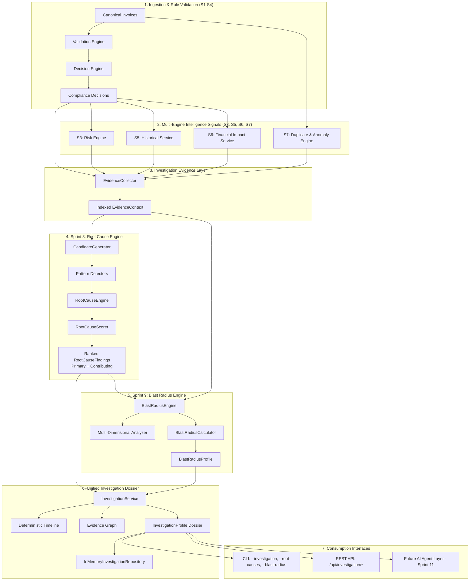

# Sprint 8 + 9 — Root Cause & Blast Radius Intelligence Engine

## 1. Objective

The **Root Cause & Impact Intelligence Engine** combines **Sprint 8 (Root Cause Intelligence)** and **Sprint 9 (Blast Radius Intelligence)** into a single, cohesive, deterministic, explainable, and audit-grade intelligence layer.

Prior to Sprint 8 + 9, UC15 answered:
- *"Is this invoice compliant?"* (S1–S2 Rule Engine)
- *"What is the risk priority?"* (S3 Risk Engine)
- *"What are the statutory master reference rules?"* (S4–S4.1 Reference Intelligence)
- *"How has this counterparty or rule behaved over time?"* (S5 Historical Intelligence)
- *"What is the quantified financial exposure?"* (S6–S6.1 Financial Impact Engine)
- *"Are there duplicate or anomalous transactions?"* (S7 Duplicate & Anomaly Intelligence)

The combined Sprint 8 + 9 engine elevates these individual observations into a structured investigation model that answers:
1. **What is happening?** (Dominant compliance discrepancies and correlated signals)
2. **Why is it happening?** (Systemic root causes vs. surface-level symptoms)
3. **What evidence supports that conclusion?** (Concrete, verifiable, weighted evidence items)
4. **Is it isolated or systemic?** (Organizational boundary classification: Isolated, Concentrated, Systemic, Emerging Systemic)
5. **How many transactions are affected?** (Exact invoice counts and portfolio ratios)
6. **Which vendors/customers/business dimensions are affected?** (Authoritative counterparty IDs, HSNs, States)
7. **Which GST rules are affected?** (Dominant and correlated rule failures)
8. **What time period is affected?** (Temporal duration, first/last detected period, monthly distribution)
9. **What financial exposure is associated with the affected population?** (Reconciled from S6 truth without double counting)
10. **What should a future AI Agent investigate next?** (Deterministic, actionable next steps for Sprint 11)

---

## 2. Architecture

The Root Cause & Blast Radius Intelligence layer sits directly downstream of all foundational engines (S1–S7) and immediately upstream of the future AI Agent layer (Sprint 11).



---

## 3. Root Cause Intelligence

### Cause vs. Symptom Distinction
A primary pitfall in compliance systems is confusing symptoms with root causes. For example, failing Gate 6 (`ITC Mismatch` or `Ineligible Credit`) is merely an **observed symptom**. The true root cause may be:
- Vendor master data configuration mismatch
- Supplier GSTR-1 delayed filing (GSTR-2B synchronization lag)
- Incorrect tax classification under Section 17(5)
- Ingestion batch duplication

The Root Cause Intelligence Engine enforces strict separation between:
- **Symptom**: The failing validation gate or alert.
- **Cause**: The underlying configuration, master data, or business process failure.
- **Contributing Factor**: Correlated secondary issues that amplify or accompany the primary cause.
- **Correlated Signal**: External or concurrent signals (e.g. statistical anomaly or duplicate candidate) that add evidentiary weight.

---

## 4. Root Cause Taxonomy

The engine utilizes a controlled, strongly typed taxonomy:

| Root Cause Type | Description | Primary Diagnostic Triggers |
| :--- | :--- | :--- |
| `MASTER_DATA` | Master data configuration defect | Gate 1 (GSTIN checksum/format failure, state mapping mismatch) concentrated in vendor master |
| `TAX_RATE_CONFIGURATION` | Statutory tax rate schedule mismatch | Gate 3 tax calculation variance between statutory HSN rate and billing lines |
| `PLACE_OF_SUPPLY` | Intra vs. inter-state allocation mismatch | Gate 4 POS mismatch, wrong CGST/SGST vs. IGST allocation |
| `ITC_PROCESS` | Input tax credit eligibility or non-reflection | Gate 6 AP invoices with GSTR-2B non-reflection or Sec 17(5) blocked credits |
| `EWB_PROCESS` | Missing or invalid electronic transit permits | Gate 5 consignments exceeding INR 50,000 threshold without active e-way bill |
| `DUPLICATE_PROCESS` | Redundant transaction submission | S7 exact/near duplicate pairs or multi-invoice clusters |
| `DATA_QUALITY` | Structural format or mandatory field omission | Unparsed attributes, malformed date strings, syntax divergence |
| `HSN_CLASSIFICATION` | Tariff schedule lookup divergence | Gate 2 unmapped or invalid HSN commodity codes |
| `INTEGRATION_SYNC` | Upstream ERP to portal sync latency | Non-reflection in GSTR-2B when supplier and tax rates are otherwise compliant |
| `PROCESS_TIMING` | Period boundary timing divergence | Adjacent tax period submission discrepancies |
| `GSTIN_CONFIGURATION` | Specific syntax/checksum configuration failure | Strict Luhn modulo-36 checksum failures |
| `TAX_CONFIGURATION` | General tax engine rule setup defect | Generalized tax formula errors |
| `REFERENCE_DATA` | Outdated reference tariff catalog | Statutory catalog version mismatch |
| `INVOICE_CAPTURE` | OCR or manual entry keying variance | Transcription variances during invoice parsing |
| `UNKNOWN` | Fallback category when evidence is insufficient | Heterogeneous or low-confidence discrepancy patterns |

---

## 5. Evidence Model

Every `RootCauseFinding` is grounded in concrete, verifiable `RootCauseEvidence` items.

### RootCauseEvidence Contract
```python
@dataclass
class RootCauseEvidence:
    evidence_id: str
    evidence_type: EvidenceType
    title: str
    description: str
    metrics: Dict[str, Any]
    affected_count: int
    source_ids: List[str]
    weight: float
    timestamp: str
```

### Controlled Evidence Types
1. `RULE_FAILURE_PATTERN`: Repeated statutory rule or gate failures.
2. `HISTORICAL_PATTERN`: Recurrence or persistence across tax periods from S5.
3. `COUNTERPARTY_PATTERN`: Concentration of discrepancies in specific supplier/buyer groups.
4. `DUPLICATE_PATTERN`: Ingestion redundancy signals from S7.
5. `ANOMALY_PATTERN`: Statistical value/frequency outliers from S7.
6. `DATA_QUALITY_PATTERN`: Missing or malformed data attributes.
7. `REFERENCE_CHANGE`: Divergence against statutory reference tables.
8. `FINANCIAL_PATTERN`: Monetary exposure concentration from S6.
9. `TEMPORAL_PATTERN`: Multi-month persistence and trends.
10. `GEOGRAPHIC_PATTERN`: Place-of-supply or state jurisdiction concentration.

---

## 6. Candidate Generation

Candidate generation is 100% deterministic:
1. The `EvidenceCollector` constructs indexed mappings (`EvidenceContext`) across invoices, decisions, financial impacts, duplicate clusters, anomaly findings, and risk assessments.
2. The `CandidateGenerator` evaluates each controlled root cause hypothesis against the indexed signals.
3. For each triggered hypothesis, concrete evidence items are collected from:
   - Rule failure details (gate number, rule ID, sample error messages)
   - Counterparty distribution (top counterparty share, affected ratio)
   - Temporal persistence (first period, last period, duration in months)
   - Quantified financial exposure (summed from S6 impacts)
   - S7 overlap (duplicate candidates and anomaly outliers)
4. If a cohort has fewer invoices than `min_population_size` (default: 2), it is flagged with `INSUFFICIENT_EVIDENCE`.

---

## 7. Scoring

The engine implements a multi-dimensional deterministic scoring function:

$$\text{Total Score} = S_{\text{evidence}} + S_{\text{recurrence}} + S_{\text{coverage}} + S_{\text{temporal}} + S_{\text{counterparty}} + S_{\text{rule}}$$

| Dimension | Max Points | Evaluation Logic |
| :--- | :---: | :--- |
| **Evidence Strength** | 30.0 | Weighted sum of independent evidence items scaled by evidence type diversity |
| **Pattern Recurrence** | 20.0 | 1 inv: 5 pts; 2–4 invs: 10 pts; 5–9 invs: 15 pts; $\ge 10$ invs: 20 pts |
| **Population Coverage** | 20.0 | $(\text{Affected Invoices} / \text{Total Failed Invoices}) \times 20.0$ |
| **Temporal Consistency** | 10.0 | 1 period: 3.0 pts; 2 periods: 6.5 pts; $\ge 3$ periods: 10.0 pts |
| **Counterparty Concentration** | 10.0 | $\text{Top Counterparty Share} \times 10.0$ |
| **Rule Concentration** | 10.0 | $\text{Rule Share} \times 10.0$ |
| **Total** | **100.0** | Normalized between 0.0 and 100.0 |

This score is completely independent of the S3 Risk Score, Anomaly Score, and Financial Exposure.

---

## 8. Confidence

Deterministic thresholds classify confidence:

| Confidence Level | Criteria |
| :--- | :--- |
| `HIGH` | $\text{Total Score} \ge 75.0$ **AND** $\ge 2$ independent evidence sources agree **AND** $\ge \text{min\_population\_size}$ |
| `MEDIUM` | $\text{Total Score} \ge 50.0$ **AND** $\ge \text{min\_population\_size}$ |
| `LOW` | $\text{Total Score} \ge 30.0$ **AND** $\ge \text{min\_population\_size}$ |
| `INSUFFICIENT_EVIDENCE` | $\text{Total Score} < 30.0$ **OR** $\text{Population} < \text{min\_population\_size}$ (default: 2) |

---

## 9. Causality Safety

To ensure enterprise safety and avoid premature accusations of fraud or counterparty default:
- The engine **never** outputs accusatory phrasing such as *"Vendor X caused the error"* or *"Fraud detected"*.
- The engine **always** outputs causality-safe phrasing:
  - *"The observed compliance discrepancies are consistent with a Master Data configuration issue..."*
  - *"The evidence indicates a potential Place of Supply classification mismatch..."*
  - *"Evidence indicates a potential Duplicate Processing anomaly, consistent with ERP batch re-upload..."*

---

## 10. Pattern Detection

Deterministic pattern modules in `app/investigation/root_cause/patterns.py` index and extract:
- **Rule Failure Patterns**: Groups gate failures by rule ID, gate number, and sample message.
- **Counterparty Patterns**: Groups failures by authoritative GSTIN, calculates vendor failure share.
- **Temporal Patterns**: Groups by `YYYY-MM`, detects multi-month continuity.
- **HSN Patterns**: Analyzes commodity concentration for tax rate discrepancies.
- **State Patterns**: Identifies place-of-supply jurisdictional clusters.
- **Financial Exposure Patterns**: Reconciles monetary exposure by impact type.

---

## 11. Blast Radius Engine

Once a root cause candidate is identified, the **Blast Radius Engine** (Sprint 9) quantifies the full organizational and financial footprint of the discrepancy cohort. It answers:
> *"How large is this issue across all operational dimensions?"*

---

## 12. Dimensions

The Blast Radius profile slices the affected cohort across 10 concrete dimensions:
1. **Transactions**: Affected invoice count and ratio of total portfolio.
2. **Counterparties**: Number of unique suppliers/buyers, top counterparty ID, and share.
3. **Rules**: Number of failing rules, dominant rule ID, and rule share.
4. **Time**: Active periods, start/end dates, monthly distribution, and duration.
5. **HSN/SAC**: Distinct commodity codes and dominant HSN.
6. **State / POS**: Geographic jurisdictions and dominant state.
7. **Financial Exposure**: Total potential exposure, average, maximum, and breakdown by type.
8. **Risk Level**: Severity (Critical, High, Medium, Low) and Priority (P1–P4) distribution.
9. **Duplicate Clusters**: Overlapping duplicate candidate pairs and clusters.
10. **Statistical Anomalies**: Overlapping value, tax rate, and frequency outliers.

---

## 13. Financial Integration

The Blast Radius Engine strictly consumes authoritative financial exposure from **Sprint 6 (Financial Impact Engine)**:
- Reconciles directly with `FinancialImpact.potential_exposure`.
- **Zero Double-Counting**: Only existing, verified financial impacts for the cohort are summed.
- Does not independently recalculate tax liabilities or statutory penalties.

---

## 14. Risk Integration

Risk metrics are consumed directly from **Sprint 3 (Risk Engine)**:
- Extracts `risk_level` and `priority` from `ComplianceDecision`.
- Builds severity and priority distributions.
- Does not modify or recalculate the underlying risk scores.

---

## 15. S7 Intelligence Integration

Duplicate and anomaly signals from **Sprint 7** are correlated into the investigation:
- Invoices in duplicate candidate pairs and clusters are tracked.
- Invoices exhibiting statistical anomalies are tracked.
- **Compound Overlap**: Identifies invoices exhibiting **both** duplicate candidate signals and anomaly outliers.
- Strict Non-Interference: Intelligence signals provide evidentiary support but do not alter compliance verdicts.

---

## 16. Historical Integration

Historical patterns from **Sprint 5** are leveraged:
- Reuses historical time-series records to verify whether an issue is recurring or newly emerged.
- Evaluates multi-period persistence without redundant database queries.

---

## 17. Concentration Analysis

Concentration metrics determine whether an issue is localized or widely distributed:
- **Top Counterparty Share**: $\frac{\text{Invoices for Top Counterparty}}{\text{Total Invoices in Cohort}}$
- **Top Rule Share**: $\frac{\text{Failures for Top Rule}}{\text{Total Failures in Cohort}}$
- **Top HSN Share**: $\frac{\text{Invoices for Top HSN}}{\text{Total Invoices in Cohort}}$
- **Top State Share**: $\frac{\text{Invoices for Top State}}{\text{Total Invoices in Cohort}}$

---

## 18. Systemic Classification

The engine deterministically classifies the operational scope:

| Classification | Deterministic Criteria |
| :--- | :--- |
| `ISOLATED` | Cohort $\le 2$ invoices **AND** $\le 1$ counterparty **AND** portfolio ratio $\le 5\%$ |
| `CONCENTRATED` | Top counterparty share $\ge 60\%$ **OR** top rule share $\ge 60\%$ |
| `SYSTEMIC` | $(\ge 3\text{ counterparties AND } \ge 2\text{ periods}) \mathbf{OR} (\text{ratio} \ge 15\%\text{ AND } \ge 2\text{ counterparties})$ |
| `EMERGING_SYSTEMIC` | Expanding trend across consecutive periods **AND** $\ge 2$ counterparties/periods |
| `INSUFFICIENT_DATA` | Cohort size $= 0$ or unclassifiable |

---

## 19. Investigation Profile

The `InvestigationProfile` is the master dossier combining Root Cause, Blast Radius, Financial Impact, Timeline, and Lineage:

```python
@dataclass
class InvestigationProfile:
    investigation_id: str
    title: str
    status: InvestigationStatus
    primary_root_cause: Optional[RootCauseFinding]
    root_cause_candidates: List[RootCauseFinding]
    blast_radius: Optional[BlastRadiusProfile]
    financial_exposure: Decimal
    exposure_summary: Dict[str, Any]
    risk_distribution: Dict[str, int]
    duplicate_signals_summary: Dict[str, Any]
    anomaly_signals_summary: Dict[str, Any]
    historical_pattern_summary: Dict[str, Any]
    concentration_summary: Dict[str, Any]
    trend: str
    systemic_classification: str
    timeline: List[Dict[str, Any]]
    evidence_graph: Dict[str, List[str]]
    recommended_investigation_areas: List[str]
    lineage: Dict[str, Any]
    detector_version: str
    timestamp: str
```

---

## 20. Evidence Graph

Traceable adjacency mapping allows visual and programmatic inspection of linkages:
```text
ROOT_CAUSE:RC-MASTER_DATA-01
  ├── EVIDENCE:EVID-RULE-R1_GSTIN_STRUCTURE
  │     ├── INVOICE:INV-8000003
  │     └── INVOICE:INV-8000015
  ├── EVIDENCE:EVID-CP-27AAACB1234A1Z5
  │     └── INVOICE:INV-8000003
  └── EVIDENCE:EVID-TEMP-2026-03-2026-05
        ├── INVOICE:INV-8000003
        └── INVOICE:INV-8000015
```

---

## 21. Lineage

Every finding and profile tracks provenance:
- Source module (`rule_failure_pattern`, `duplicate_intelligence_s7`, `fallback`)
- Primary gate and rule identifiers
- Configuration policy version (`1.0`)
- Engine version (`1.0`)
- Exact invoice IDs and source timestamps

---

## 22. Versioning

- `root_cause_engine_version = "1.0"`
- `blast_radius_engine_version = "1.0"`
- Policy schemas are versioned in `config/investigation/`.
- Future engine enhancements will maintain backwards compatibility with existing stored profiles.

---

## 23. Configuration

Externalized in `config/investigation/`:
- `root_cause_policy.yaml`: Scoring weights, confidence thresholds, likelihood thresholds, and pattern gates.
- `blast_radius_policy.yaml`: Trend analysis parameters, systemic classification thresholds, and dimension limits.
- Typed loader in `app/investigation/config/investigation_config.py` with robust fallbacks.

---

## 24. API Endpoints

Integrated into `ui/app.py`:

| Method | Endpoint | Description |
| :--- | :--- | :--- |
| `GET` | `/api/investigation/summary` | High-level summary of the primary root cause, blast radius, and exposure |
| `GET` | `/api/investigation/root-causes` | Ranked list of all identified root cause candidates |
| `GET` | `/api/investigation/root-causes/{id}` | Specific root cause candidate details, score breakdown, and evidence |
| `GET` | `/api/investigation/blast-radius/{id}` | Multi-dimensional blast radius profile |
| `GET` | `/api/investigation/{id}` | Complete investigation dossier (JSON) including timeline and evidence graph |

---

## 25. CLI Interface

Added to `main.py`:
- `--investigation`: High-level executive investigation report.
- `--root-causes`: Detailed breakdown of all candidate root causes.
- `--blast-radius`: Comprehensive multi-dimensional blast radius analysis.

Sample Command:
```bash
python main.py --mock --investigation
```

---

## 26. Testing & Quality Assurance

The suite enforces 100% pass rates across:
1. **Existing Baseline**: 256/256 tests passing.
2. **Root Cause Unit Tests** (`test_root_cause_intelligence.py`): 12 dedicated tests.
3. **Blast Radius Unit Tests** (`test_blast_radius_intelligence.py`): 14 dedicated tests.
4. **Reconciliation & Integration Tests** (`test_investigation_reconciliation.py`): 10 dedicated tests.
5. **Total Test Suite**: 292/292 tests passing.
6. **Dedicated Verification Script** (`scripts/verify_s8_s9_investigation.py`): 15/15 scenarios passing.

---

## 27. Limitations

1. **Deterministic Candidate Generation**: Hypotheses are derived from configured statutory rules and intelligence signals; novel unforeseen business anomalies outside statutory checks rely on the `UNKNOWN` fallback.
2. **In-Memory Repository**: Standard deployment uses in-memory storage; production persistence across restarts requires database backing.
3. **Absence of Autonomous Actions**: The engine identifies root causes and blast radii, but intentionally does not trigger automatic SAP adjustments, invoice cancellations, or tax reversals.

---

## 28. Future AI Agent Integration (Sprint 11 Contract)

The `InvestigationProfile` serves as the primary grounded input for the future AI Agent:
- When a human or system asks *"Why did ITC risk increase in Q2?"*, the AI Agent will consume `InvestigationProfile`:
  - Primary Root Cause: `ITC_PROCESS`
  - Evidence: 4 months of consecutive GSTR-2B non-reflection for Vendor X
  - Blast Radius: 184 invoices, INR 8.42L exposure, 91% vendor concentration
  - Recommended Investigation: *"Execute GSTR-2B settlement reconciliation with Vendor X."*
- The AI Agent generates human-facing natural language explanations backed by verifiable facts, completely eliminating hallucination.
